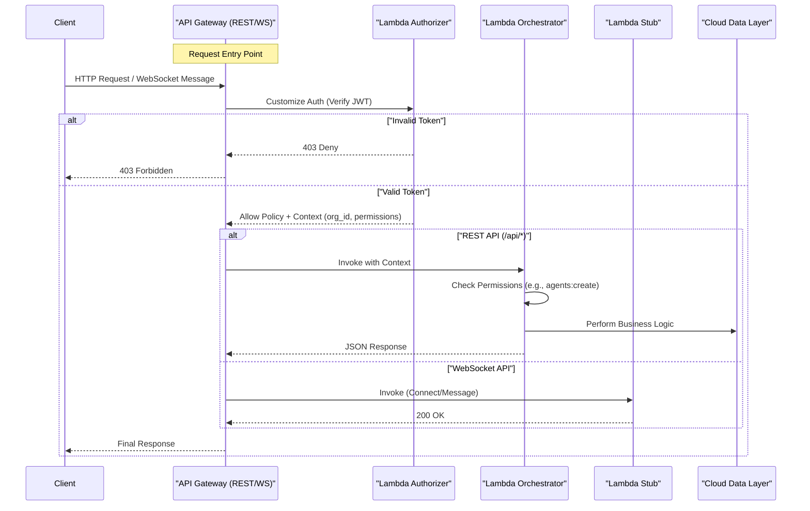

# AWS Lambda & API Gateway Guide

This guide provides a comprehensive overview of the serverless backend architecture for the Multi-Tenant SaaS platform. It covers the request flow, Lambda function logic, security mechanisms, and infrastructure configuration.

> **Related Documents:**
> *   [PROJECT_OVERVIEW.md](./PROJECT_OVERVIEW.md) - High-level project summary
> *   [RBAC_WORKFLOW.md](./RBAC_WORKFLOW.md) - Deep dive into the permissions model

---

## 1. High-Level Architecture

The backend follows a **Serverless Request-Reply** pattern using AWS API Gateway and Lambda.



### Key Components

1.  **API Gateway**: The entry point for all client requests.
    *   **REST API**: Handles resource management (`users`, `orgs`, `agents`).
    *   **WebSocket API**: Handles real-time connections and status updates.
2.  **Lambda Authorizer**: A dedicated function that secures all endpoints by validating JWTs.
3.  **Lambda Orchestrator**: The main business logic entry point. It routes requests based on the path and method, enforcing fine-grained RBAC.
4.  **Lambda Stub**: A placeholder for future real-time features.

---

## 2. Infrastructure Configuration

The infrastructure is defined in Terraform.

### 2.1 API Gateway (`terraform/api_gateway.tf`)

*   **REST API Resources**:
    *   Paths: `/api/agents`, `/api/users`, `/api/orgs`
    *   Method: `ANY` (GET, POST, PUT, DELETE, etc.)
    *   Integration: `AWS_PROXY` to the **Orchestrator** Lambda.
*   **WebSocket API Routes**:
    *   `$connect`, `$disconnect`, `$default`: Standard WebSocket lifecycle events.
    *   `task-status`: Custom route for client messages.
    *   Integration: `AWS_PROXY` to the **Stub** Lambda.

### 2.2 Lambda Functions (`terraform/lambda.tf`)

All functions run on `nodejs18.x` and share an IAM role (`lambda_exec`) that allows basic execution and logging.

| Function Name | Terraform ID | Handler | Source |
| :--- | :--- | :--- | :--- |
| **Authorizer** | `aws_lambda_function.authorizer` | `index.handler` | `backend/lambdas/authorizer/` |
| **Orchestrator** | `aws_lambda_function.orchestrator` | `index.handler` | `backend/lambdas/orchestrator/` |
| **API Stub** | `aws_lambda_function.api_stub` | `index.handler` | `backend/lambdas/stub/` |

**Environment Variables:**
*   `JWT_KEY`: Used by the Authorizer to verify signatures. Currently defaults to `"development-secret"` but should be synced from AWS Secrets Manager in production.

---

## 3. Lambda Implementation Details

### 3.1 Lambda Authorizer (`backend/lambdas/authorizer`)

This is a **Token-based Custom Authorizer**.

**Workflow:**
1.  **Input**: Receives `event.authorizationToken` (or header).
2.  **Processing**:
    *   Extracts the Bearer token.
    *   Calls `verifyToken(token)` from `utils/auth_util.js`.
3.  **Output**:
    *   If valid: Returns an IAM Policy allowing `execute-api:Invoke`.
    *   **Crucial Step**: It attaches a `context` object to the policy containing:
        *   `org_id`: The user's tenant ID.
        *   `permissions`: A JSON-stringified array of permissions (e.g., `["org:read", "agents:create"]`).
        *   `email`: User's email.
    *   If invalid: Returns a Deny policy.

### 3.2 Lambda Orchestrator (`backend/lambdas/orchestrator`)

This function acts as a **Controller** for the REST API.

**Workflow:**
1.  **Context Extraction**: Reads `event.requestContext.authorizer` to get the user's `org_id` and `permissions`.
2.  **Routing & Permission Check**:
    *   Determines the required permission based on the request:
        *   `POST /api/agents` &rarr; requires `agents:create`
        *   `POST /api/users` &rarr; requires `users:manage`
        *   `PUT /api/orgs` &rarr; requires `org:manage`
        *   Default &rarr; requires `read`
    *   Calls `permissions.hasPermission(context, requiredPermission)`.
3.  **Execution**:
    *   If unauthorized: Returns `403 Forbidden`.
    *   If authorized: Executes the logic (currently a success placeholder, will eventually publish to RabbitMQ).
4.  **Special Endpoint**:
    *   `POST /api/validate-permissions`: A utility endpoint that allows the frontend to send a list of permissions and check if the current user has them.

### 3.3 Lambda Stub (`backend/lambdas/stub`)

A simple echo function for WebSockets.

**Workflow:**
*   Logs the incoming event.
*   Returns `200 OK` with a success message.
*   **Purpose**: Keeps the WebSocket connection alive and acknowledges messages until the real message routing logic is built.

---

## 4. Shared Utilities

To avoid code duplication, logic is shared across functions via the `utils` directory.

### 4.1 Authentication (`backend/lambdas/utils/auth.js`)

*   `createEnrichedToken(user, orgId, permissions)`: Signs a JWT containing the user's RBAC details. Used by the login flow (not yet implemented in Lambda, currently in `src/lib/auth-enrichment.ts` for the frontend).
*   `verifyToken(token)`: Verifies the JWT signature using `process.env.JWT_KEY`.

### 4.2 Permissions (`backend/lambdas/utils/permissions.js`)

*   `hasPermission(context, requiredPermission)`: The core RBAC enforcer.
    *   Checks if the user has a **Wildcard (`*`)** permission (Super Admin).
    *   Checks if the user has the **Exact** required permission.
*   `getOrgId(context)`: Safely extracts the organization ID.

---

## 5. Deployment & Testing

### Deployment

Deploy the entire stack (Infrastructure + Code) using the Makefile:

```bash
make deploy-infra
```

This runs `terraform apply`, which zips the Lambda code directories and updates the functions in AWS.

### Local Testing (Manual)

Since the Lambdas are behind an Authorizer, you need a valid JWT to test them via `curl`.

1.  **Generate a Token** (using the provided helper script or by logging in via the frontend once built).
2.  **Invoke the API**:

```bash
# Export your API URL
export API_URL="https://your-api-id.execute-api.region.amazonaws.com/prod"

# Test the agents endpoint
curl -X POST "$API_URL/api/agents" \
  -H "Authorization: Bearer <YOUR_JWT>" \
  -H "Content-Type: application/json" \
  -d '{"name": "Agent 007"}'
```

**Expected Responses:**
*   **200 OK**: "Orchestration successful" (if you have `agents:create`).
*   **403 Forbidden**: "You do not have the required permission" (if you lack permission).
*   **401 Unauthorized**: (if token is missing or invalid - handled by API Gateway/Authorizer).
