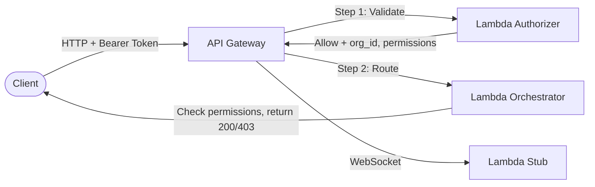
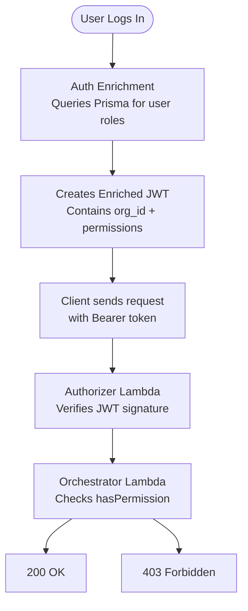
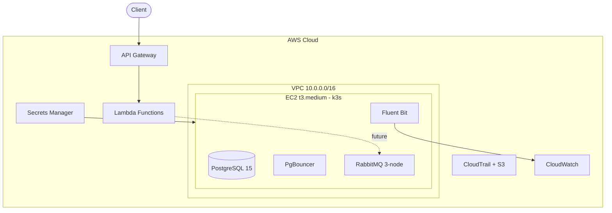

# Learning Plan: MultiTenantSaas Project Mastery

This plan is organized into 6 progressive phases. Each phase builds on the previous one, starting from language/tool fundamentals and ending with the full project architecture. Estimated total: **4-6 weeks** depending on pace.

---

## Phase 1: JavaScript and Node.js Fundamentals (Week 1)

You need this because all 3 Lambda functions in `backend/lambdas/` are written in plain JavaScript, and the frontend uses TypeScript.

### Core Concepts to Learn

- **JavaScript basics:** variables (`const`, `let`), arrow functions (`=>`), template literals, destructuring, spread operator
- **Async programming:** Promises, `async/await` -- this is critical because every Lambda handler is an `async function`
- **Modules:** `require()` (CommonJS) -- used in all Lambda files, e.g. `const jwt = require('jsonwebtoken')`
- **Node.js runtime:** What Node.js is (server-side JS), how `exports.handler` works, the event loop
- **npm:** `package.json`, `npm install`, `node_modules`, dependency management

### Where to See This in the Project

- [backend/lambdas/authorizer/index.js](backend/lambdas/authorizer/index.js) -- a Lambda handler using `async`, `require`, `exports.handler`
- [backend/lambdas/orchestrator/index.js](backend/lambdas/orchestrator/index.js) -- path parsing, conditionals, destructuring
- [backend/lambdas/authorizer/auth_util.js](backend/lambdas/authorizer/auth_util.js) -- JWT signing/verification with `jsonwebtoken`

### Recommended YouTube Tutorials

- **JavaScript Fundamentals:**
  - [JavaScript Fundamentals: Building a Strong Foundation](https://www.youtube.com/playlist?list=PLQyfMZ4iIv1vM1VnPr35cnZ6b97TPStjG) -- playlist covering all core JS concepts
  - [JavaScript: Zero to Hero](https://www.youtube.com/playlist?list=PL4CCSwmU04MgN15Z_YN7I5S6W70DZ1csu) -- beginner-friendly full playlist
- **Node.js:**
  - [Node.js Crash Course -- Traversy Media (2h)](https://www.youtube.com/watch?v=fBNz5xF-Kx4) -- 1.6M views, covers core modules, HTTP server, routing (no frameworks)
  - [Node.js Tutorial for Beginners 2025 -- Pure Node (2h)](https://www.youtube.com/watch?v=CMpQAtYuegk) -- modules, file system, HTTP servers, routing with zero external packages
  - [Node.js Crash Course Tutorial -- Net Ninja playlist](https://www.youtube.com/playlist?list=PL4cUxeGkcC9jsz4LDYc6kv3ymONOKxwBU) -- step-by-step series

### Other Resources

- **freeCodeCamp JavaScript course** (free, interactive)
- **Node.js official "Getting Started" guide** at nodejs.org
- Practice: write a small script that reads a JSON file and prints filtered results

---

## Phase 2: AWS Fundamentals and Lambda (Week 1-2)

You need this because the entire backend runs on AWS services orchestrated by Terraform.

### Core AWS Concepts

- **AWS Account & IAM:** Users, roles, policies -- the project defines IAM roles in [terraform/main.tf](terraform/main.tf) and [terraform/lambda.tf](terraform/lambda.tf)
- **AWS Lambda:** Serverless functions triggered by events. Key concepts:
  - **Handler:** The entry point function (`exports.handler = async (event, context) => { ... }`)
  - **Event object:** Contains HTTP request data (path, method, headers, body)
  - **Context object:** Contains runtime info (request ID, function name)
  - **Cold starts:** First invocation takes longer
  - **Packaging:** Code is zipped and uploaded (see `data "archive_file"` blocks in [terraform/lambda.tf](terraform/lambda.tf))
- **API Gateway:** HTTP front door that routes requests to Lambdas. Two types in this project:
  - **REST API** -- for `/api/agents`, `/api/users`, `/api/orgs`, `/api/validate-permissions`
  - **WebSocket API** -- for real-time connections (currently a stub)
  - Defined in [terraform/api_gateway.tf](terraform/api_gateway.tf)
- **Lambda Authorizer:** A special Lambda that runs before your main Lambda to validate auth tokens -- this is the `authorizer` Lambda
- **Secrets Manager:** Stores sensitive values (DB password, JWT key, LLM keys) -- see [terraform/secrets.tf](terraform/secrets.tf)
- **CloudWatch:** Logs and metrics -- the project uses it for Lambda logs and EC2 auto-shutdown alarms
- **EC2:** Virtual server -- runs k3s (lightweight Kubernetes) for PostgreSQL and RabbitMQ
- **VPC:** Virtual private network -- the project creates one in [terraform/main.tf](terraform/main.tf)

### The 3 Lambda Functions in This Project

1. **Authorizer** (`backend/lambdas/authorizer/`) -- Validates JWT tokens, extracts `org_id` and `permissions`
2. **Orchestrator** (`backend/lambdas/orchestrator/`) -- Receives authorized requests, checks RBAC permissions per endpoint
3. **Stub** (`backend/lambdas/stub/`) -- Placeholder for WebSocket routes, returns 200 OK

### Recommended YouTube Tutorials

- **AWS Lambda + API Gateway + Serverless (full picture):**
  - [AWS Serverless with Lambda, API Gateway & EventBridge -- Full Beginner Course](https://www.youtube.com/watch?v=5rG-YgTHMC8) -- covers Lambda basics, building REST APIs with Lambda, EventBridge, SQS, SNS
- **AWS IAM (roles & policies):**
  - [AWS IAM Users, Roles, and Policies in 5 Minutes](https://www.youtube.com/watch?v=xST_Qfg8i1E) -- quick conceptual overview, watch this first
  - [AWS IAM Tutorial 2025 -- Users, Groups, Policies & MFA (16min)](https://www.youtube.com/watch?v=wwQl0n7C5-M) -- hands-on walkthrough with custom policies
- **Lambda Authorizer (used in this project):**
  - [Secure your API Gateway with Lambda Authorizer -- Step by Step (178K views)](https://www.youtube.com/watch?v=al5I9v5Y-kA) -- exactly what this project does: create authorizer, attach to API Gateway
  - [Securing Your API with Lambda Authorizer -- AWS Demo](https://www.youtube.com/watch?v=OqWg4_L-4E0) -- another hands-on walkthrough
- **AWS Secrets Manager:**
  - [AWS Secrets Manager Step-by-Step: Store, Rotate & Delete Secrets (5min)](https://youtube.com/watch?v=ItzzgWe7elE) -- quick practical demo
  - [AWS Secrets Manager Tutorial -- Securely Store and Rotate (3min)](https://www.youtube.com/watch?v=GQaZiap2gSo) -- integration with Lambda, EC2, RDS

### Other Resources

- **AWS Free Tier** -- sign up and experiment
- **AWS Lambda Developer Guide** (official docs)
- Practice: deploy a "Hello World" Lambda via the AWS Console

---

## Phase 3: Terraform and Infrastructure as Code (Week 2-3)

You need this because all AWS infrastructure is defined in the `terraform/` directory.

### Core Terraform Concepts

- **What is IaC:** Defining infrastructure in code files instead of clicking in AWS Console
- **HCL syntax:** Terraform's language -- blocks like `resource`, `variable`, `output`, `data`, `provider`
- **Resources:** Each `resource` block creates one AWS thing (e.g., `aws_lambda_function`, `aws_instance`)
- **Variables:** Inputs defined in [terraform/variables.tf](terraform/variables.tf) -- `aws_region`, `project_name`, `instance_type`
- **Outputs:** Values printed after apply, defined in [terraform/outputs.tf](terraform/outputs.tf) -- EC2 IP, API URLs
- **State:** Terraform tracks what it has created in a state file (`.tfstate`)
- **Commands:** `terraform init` (setup), `terraform plan` (preview), `terraform apply` (deploy), `terraform destroy` (teardown)
- **Provider:** Configures which cloud to talk to -- AWS provider in [terraform/provider.tf](terraform/provider.tf)
- **Data sources:** Read existing resources or generate values (e.g., `data "archive_file"` to zip Lambda code)
- **References:** Resources reference each other, e.g., `aws_lambda_function.orchestrator.arn`

### Project Terraform File Map

| File                                                 | What It Creates                                                       |
| ---------------------------------------------------- | --------------------------------------------------------------------- |
| [terraform/provider.tf](terraform/provider.tf)       | AWS provider config (region us-east-1)                                |
| [terraform/variables.tf](terraform/variables.tf)     | Input variables with defaults                                         |
| [terraform/main.tf](terraform/main.tf)               | VPC, subnet, EC2 (k3s server), IAM, security groups, CloudWatch alarm |
| [terraform/lambda.tf](terraform/lambda.tf)           | 3 Lambda functions, IAM roles, zip packaging                          |
| [terraform/api_gateway.tf](terraform/api_gateway.tf) | REST API + WebSocket API + routes + authorizer attachment             |
| [terraform/secrets.tf](terraform/secrets.tf)         | 3 Secrets Manager secrets + IAM policy for EC2                        |
| [terraform/logging.tf](terraform/logging.tf)         | CloudTrail + S3 bucket + CloudWatch log group                         |
| [terraform/outputs.tf](terraform/outputs.tf)         | Outputs (IPs, URLs, secret names)                                     |

### Recommended YouTube Tutorials

- **Terraform on AWS (start here):**
  - [Terraform on AWS: The Ultimate Beginner's Guide 2025 (16min)](https://www.youtube.com/watch?v=RiBSzAgt2Hw) -- credentials setup, variables, EC2 deployment, init/plan/apply workflow
  - [Terraform Tutorial on AWS -- Getting Started (36min)](https://www.youtube.com/watch?v=Qfg6hRY4Tq0) -- deeper dive into state, creating/modifying/importing EC2, part of a full playlist covering VPC and modules
- **Terraform deep dives:**
  - [Complete Terraform Crash Course -- Beginner to Pro 2025](https://www.youtube.com/watch?v=KVmsx4QeqEU) -- covers iterators, advanced patterns
  - [AWS Terraform Full Course: Modules for Beginners (playlist)](https://www.youtube.com/playlist?list=PL184oVW5ERMCxA4336x_TM7q1Cs8y0x1s) -- dedicated to Terraform modules

### Other Resources

- **HashiCorp Terraform tutorials** at developer.hashicorp.com/terraform/tutorials (start with "Get Started - AWS")
- Practice: write a Terraform file that creates an S3 bucket, then `plan` and `apply` it

---

## Phase 4: Project-Specific Patterns Deep Dive (Week 3-4)

Now that you understand the building blocks, study how they fit together in this project.

### 4a. Multi-Tenancy and RBAC

**Watch first:**

- [Multi-Tenant SaaS Architecture in 3 Simple Steps (39min)](https://www.youtube.com/watch?v=bFLGwVyIotA) -- what multi-tenancy is, entity relationships, RBAC, org switching (33K views)
- [JWT Authentication in Node.js -- Net Ninja playlist (18 lessons)](https://www.youtube.com/playlist?list=PL4cUxeGkcC9iqqESP8335DA5cRFp8loyp) -- JWT theory, signup/login, protected routes, exactly the pattern used in this project
- [Node.js Auth API with JWT, PostgreSQL & Prisma (1h 23min)](https://www.youtube.com/watch?v=urt4U4a6uI4) -- very close to this project's stack: JWT + Prisma + PostgreSQL auth system

Then read [RBAC_WORKFLOW.md](RBAC_WORKFLOW.md) thoroughly. The key idea:

- **Prisma schema** in [frontend/prisma/schema.prisma](frontend/prisma/schema.prisma) -- defines Organization, User, Role, Permission, UserOrganizationRole
- **Auth enrichment** in [frontend/src/lib/auth-enrichment.ts](frontend/src/lib/auth-enrichment.ts) -- queries DB for a user's roles in an org
- **JWT creation** in [backend/lambdas/authorizer/auth_util.js](backend/lambdas/authorizer/auth_util.js) -- `createEnrichedToken()`
- **Permission checks** in [backend/lambdas/orchestrator/permissions.js](backend/lambdas/orchestrator/permissions.js) -- `hasPermission()`, `getOrgId()`

### 4b. API Gateway Request Flow

Study [terraform/api_gateway.tf](terraform/api_gateway.tf) to understand:

- How REST routes (`/api/agents`, `/api/users`, etc.) are defined using `for_each`
- How the Lambda Authorizer is attached to every route
- How WebSocket routes work differently (route selection via `$request.body.action`)

### 4c. Infrastructure Architecture

Read [DESIGN_ARCH.md](DESIGN_ARCH.md) and [INFRA_RUNBOOK.md](INFRA_RUNBOOK.md) for the full picture:

---

## Phase 5: Supporting Technologies (Week 4-5)

These are secondary but important for the full picture.

### 5a. Kubernetes Basics (for k3s)

**Watch first:**

- [Kubernetes Crash Course -- KodeKloud (2h 10min, 1M+ views)](https://www.youtube.com/watch?v=XuSQU5Grv1g) -- containers, pods, replicasets, deployments, services + hands-on microservice project with free labs
- [Kubernetes for Absolute Beginners -- Full 2-Hour Crash Course](https://www.youtube.com/watch?v=ljqLf1s5l3w) -- core concepts, kubectl commands, YAML configs
- [Kubernetes Crash Course for Beginners -- Hands-On + First Deployment (19min)](https://www.youtube.com/watch?v=9AKSLbfen6w) -- quick version if you want a fast overview first

- **What k3s is:** Lightweight Kubernetes that runs on a single EC2 instance
- **Key concepts:** Pods, Deployments, StatefulSets, Services, Namespaces, PersistentVolumeClaims
- **Project K8s manifests** in `backend/k8s/`:
  - [backend/k8s/postgresql.yaml](backend/k8s/postgresql.yaml) -- PostgreSQL StatefulSet
  - [backend/k8s/pgbouncer.yaml](backend/k8s/pgbouncer.yaml) -- Connection pooler
  - [backend/k8s/rabbitmq/rabbitmq.yaml](backend/k8s/rabbitmq/rabbitmq.yaml) -- Message queue cluster
  - [backend/k8s/cloudwatch-logging.yaml](backend/k8s/cloudwatch-logging.yaml) -- Fluent Bit log forwarder
- Read [KUBERNETES_GUIDE.md](KUBERNETES_GUIDE.md) -- project-specific K8s guide

### 5b. Prisma ORM

**Watch first:**

- [Prisma Complete Course 2025 -- Modern Database ORM for Node.js & TypeScript (2h 11min)](https://www.youtube.com/watch?v=3AldkDy7TQ4) -- setup, data modeling, CRUD, relations, migrations, seeding, best practices

- **What it is:** Type-safe database toolkit for Node.js/TypeScript
- **Schema file:** [frontend/prisma/schema.prisma](frontend/prisma/schema.prisma) defines all tables and relationships
- **Seed script:** [frontend/prisma/seed.ts](frontend/prisma/seed.ts) populates default roles and permissions
- **Key commands:** `npx prisma generate`, `npx prisma migrate`, `npx prisma db seed`

### 5c. Next.js Frontend (minimal currently)

**Watch first:**

- [Next.js 15 Crash Course: Build a Production-Ready App -- JavaScript Mastery (5.3h, 1.3M views)](https://www.youtube.com/watch?v=Zq5fmkH0T78) -- routing, rendering, full-stack features, auth, deployment
- [Next.js Tutorial 2026 -- Start Your Journey Here (56min)](https://www.youtube.com/watch?v=KAQCHfu_3jw) -- quick intro covering routing, data fetching, Prisma, server actions
- [Next.js Full Tutorial: Beginner to Advanced (6.8h)](https://www.youtube.com/watch?v=k7o9R6eaSes) -- comprehensive deep-dive if you want the full picture

- The frontend is a Next.js 16 app with React 19 and Tailwind CSS 4
- Currently only has the auth enrichment library -- no pages/UI yet
- Located in [frontend/](frontend/) with a Dockerfile for deployment

---

## Phase 6: DevOps and Deployment Workflow (Week 5-6)

### 6a. Makefile Commands

The [Makefile](Makefile) ties everything together:

- `make deploy-infra` -- full deploy (Terraform + K8s + secrets)
- `make terraform-apply` -- just Terraform
- `make k8s-deploy` -- just Kubernetes manifests
- `make sync-secrets` -- sync AWS secrets to K8s
- `make bootstrap-secrets` -- initial secret creation

### 6b. CI/CD Pipeline

- [.github/workflows/infra-ci.yml](.github/workflows/infra-ci.yml) runs on push/PR to `main`, `dev`, `infra/*`
- Validates Terraform syntax and K8s YAML structure
- No auto-deploy yet (validation only)

### 6c. Scripts

- [backend/scripts/bootstrap-aws-secrets.sh](backend/scripts/bootstrap-aws-secrets.sh) -- creates initial secrets in AWS
- [backend/scripts/sync-secrets.sh](backend/scripts/sync-secrets.sh) -- syncs secrets from AWS to K8s

---

## Suggested Reading Order for Project Docs

1. [PROJECT_OVERVIEW.md](PROJECT_OVERVIEW.md) -- start here for the full project map
2. [DESIGN_ARCH.md](DESIGN_ARCH.md) -- high-level architecture
3. [RBAC_WORKFLOW.md](RBAC_WORKFLOW.md) -- the core security model
4. [INFRA_RUNBOOK.md](INFRA_RUNBOOK.md) -- step-by-step deployment guide
5. [KUBERNETES_GUIDE.md](KUBERNETES_GUIDE.md) -- K8s concepts applied to this project

---

## Quick Reference: Key Files to Study

| Priority | File                                          | Why                                    |
| -------- | --------------------------------------------- | -------------------------------------- |
| 1        | `backend/lambdas/authorizer/index.js`         | Simplest Lambda, shows handler pattern |
| 2        | `backend/lambdas/authorizer/auth_util.js`     | JWT signing/verification               |
| 3        | `backend/lambdas/orchestrator/index.js`       | Main business logic Lambda             |
| 4        | `backend/lambdas/orchestrator/permissions.js` | RBAC permission checking               |
| 5        | `frontend/prisma/schema.prisma`               | Data model for multi-tenancy           |
| 6        | `frontend/src/lib/auth-enrichment.ts`         | How user data is loaded from DB        |
| 7        | `terraform/lambda.tf`                         | How Lambdas are defined in Terraform   |
| 8        | `terraform/api_gateway.tf`                    | How API routes are configured          |
| 9        | `terraform/main.tf`                           | VPC, EC2, networking infrastructure    |
| 10       | `Makefile`                                    | How to deploy everything               |
