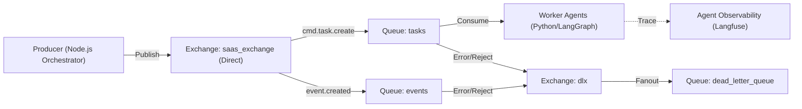

# RabbitMQ Guide

This document explains the basics of RabbitMQ and details how it is implemented in the Multi-Tenant SaaS architecture to enable asynchronous processing and decoupling.

## 1. RabbitMQ Basics

RabbitMQ is a message broker that acts as a middleman for various services. It routes messages from producers to consumers.

### Core Concepts

*   **Producer**: The service that sends a message (e.g., Lambda Orchestrator).
*   **Consumer**: The service that processes the message (e.g., Background Workers).
*   **Exchange**: The entry point for the producer. It receives messages and routes them to queues based on rules (bindings).
*   **Queue**: A buffer that holds messages until a consumer is ready to process them.
*   **Binding**: A link between an exchange and a queue, often with a "routing key" filter.
*   **DLQ (Dead Letter Queue)**: A safety net queue where messages are sent if they cannot be processed (e.g., after max retries).

---

## 2. Project Architecture

We use a **Direct Exchange** with **Shared Queues**. All tenant traffic shares the same `tasks` and `events` queues. Multi-tenancy is handled at the *worker* level by inspecting the payload (`org_id`), rather than at the *infrastructure* level.

### 2.1 Topology Overview



### 2.2 Components

#### Exchange: `saas_exchange` (Direct)
*   **Type**: `direct`
*   **Purpose**: The main bus for all system messages.
*   **Features**: Durable (survives restarts).

#### Queue: `tasks`
*   **Purpose**: Shared queue for all command messages (e.g., "Create Agent") across all tenants.
*   **Routing Key**: `cmd.task.create`
*   **Payload**: Must include `org_id` context.

#### Queue: `events`
*   **Purpose**: Shared queue for all event messages (e.g., "Agent Created").
*   **Routing Key**: `event.created`

#### Queue: `dead_letter_queue`
*   **Purpose**: Global holding area for failed messages requiring manual inspection.

### 2.3 Consumers

#### Worker Agents (Python)
*   **Technology**: Python, Pika, LangGraph.
*   **Role**: Consumes from the `tasks` queue. Executes AI workflows (Counselor, Enrollment, Support).
*   **Observability**: Integrates with **Langfuse** for tracing and monitoring agent performance.

---

## 3. Implementation Details

The logic is encapsulated in `backend/lambdas/utils/rabbitmq.js`.

### 3.1 Code Usage

Use `publishMessage` to send data to the shared queues.

```javascript
const { publishMessage } = require('./utils/rabbitmq');

await publishMessage(
    'cmd.task.create',   // Fixed Routing Key
    {                    // Payload
        org_id: 'org_123', // Context is now in the payload
        action: 'create_agent',
        data: { name: 'Agent Smith' }
    }
);
```

**What happens under the hood:**
1.  Connects to RabbitMQ.
2.  Asserts `saas_exchange` (Direct) and `dead_letter_queue`.
3.  Asserts `tasks` queue and binds with `cmd.task.create`.
4.  Asserts `events` queue and binds with `event.created`.
5.  Publishes the message to `saas_exchange`.

### 3.2 Kubernetes Deployment

RabbitMQ is deployed as a 3-node HA cluster using a StatefulSet.

*   **Manifest**: `backend/k8s/rabbitmq/rabbitmq.yaml`
*   **Service**: `rabbitmq.data.svc.cluster.local` (Port 5672 for AMQP).
*   **Credentials**: Stored in k8s Secret `rabbitmq-secret`.

---

## 4. Operational Guide

### Accessing the Management UI

The RabbitMQ Management Plugin is enabled. You can access it locally via port-forwarding:

```bash
# Forward port 15672
kubectl port-forward svc/rabbitmq -n data 15672:15672
```

1.  Open [http://localhost:15672](http://localhost:15672).
2.  Login with: `admin` / `admin` (default dev credentials).
