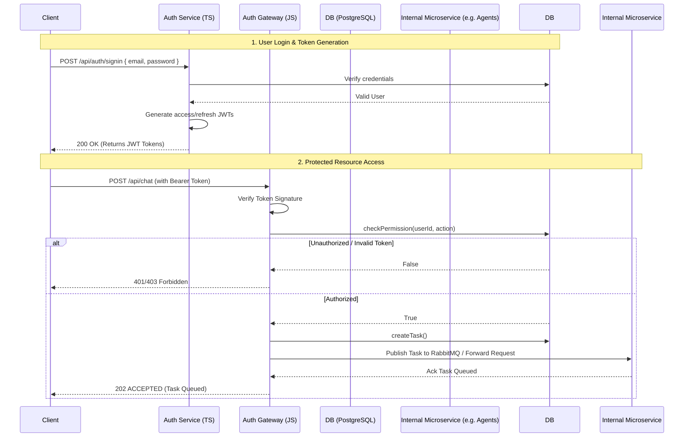

# Auth Flow Architecture

Here is the flowchart visualizing how the User Authentication Service (TypeScript) and the Auth Gateway (JavaScript) interact to secure the platform.

```mermaid
sequenceDiagram
    participant Client
    participant Auth Service (TS)
    participant Auth Gateway (JS)
    participant DB (PostgreSQL)
    participant Internal Microservice (e.g. Agents)

    %% Step 1 & 2: Authentication
    Note over Client, DB: 1. User Login & Token Generation
    Client->>Auth Service (TS): POST /api/auth/signin { email, password }
    Auth Service (TS)->>DB: Verify credentials
    DB-->>Auth Service (TS): Valid User
    Auth Service (TS)->>Auth Service (TS): Generate access/refresh JWTs
    Auth Service (TS)-->>Client: 200 OK (Returns JWT Tokens)

    %% Step 3, 4 & 5: Resource Access
    Note over Client, Internal Microservice: 2. Protected Resource Access
    Client->>Auth Gateway (JS): POST /api/chat (with Bearer Token)
    
    %% Token Verification & RBAC
    Auth Gateway (JS)->>Auth Gateway (JS): Verify Token Signature
    Auth Gateway (JS)->>DB: checkPermission(userId, action)
    
    alt Unauthorized / Invalid Token
        DB-->>Auth Gateway (JS): False
        Auth Gateway (JS)-->>Client: 401/403 Forbidden
    else Authorized
        DB-->>Auth Gateway (JS): True
        Auth Gateway (JS)->>DB: createTask()
        Auth Gateway (JS)->>Internal Microservice: Publish Task to RabbitMQ / Forward Request
        Internal Microservice-->>Auth Gateway (JS): Ack Task Queued
        Auth Gateway (JS)-->>Client: 202 ACCEPTED (Task Queued)
    end
```
