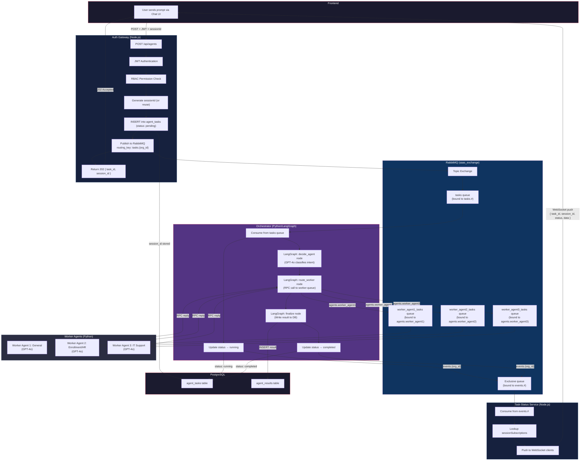

# Multi-Tenant SaaS — End-to-End Agent Flow

## Full Flow Diagram



## Step-by-Step Walkthrough

### 1. User Sends a Prompt
The frontend sends a `POST` request to the Auth Gateway with the user's message and a JWT token:
```bash
curl -X POST http://<EC2_IP>/api/agents \
  -H "Authorization: Bearer <JWT_TOKEN>" \
  -H "Content-Type: application/json" \
  -d '{"prompt": "How do I enroll in the 401k plan?", "sessionId": "optional-uuid"}'
```

### 2. Auth Gateway Processes the Request
- **JWT Authentication**: Validates the token and extracts `user_id` and `org_id`.
- **RBAC Check**: Verifies the user has `agents:create` permission.
- **Session ID**: Uses the provided `sessionId` or generates a new UUID.
- **Task Creation**: Inserts a row into `agent_tasks` with status `pending`.
- **RabbitMQ Publish**: Publishes the task to `saas_exchange` with routing key `tasks.{org_id}`.
- **Response**: Returns `202 Accepted` with `task_id` and `session_id`.

### 3. Orchestrator Picks Up the Task
- Consumes the message from the `tasks` queue.
- Updates task status to `running` (this triggers a WebSocket push).
- Runs the **LangGraph** workflow:
  1. **Decide Agent** — GPT-4o classifies the user's intent (General / Enrollment / Support).
  2. **Route Worker** — Sends an RPC call to the selected worker's queue and waits for the response.
  3. **Finalize** — Writes the result to `agent_results` and updates status to `completed`.

### 4. Worker Agent Responds
- The selected worker (e.g., Worker Agent 2 for enrollment) receives the RPC message.
- It calls GPT-4o with a specialized system prompt.
- It returns the LLM's response back to the Orchestrator via the RPC reply queue.

### 5. Real-Time WebSocket Updates
- Every status change (`running`, `completed`, `failed`) is published to `events.{org_id}`.
- The **Task-Status Service** consumes these events and pushes them to all WebSocket clients subscribed to that `session_id`.

---

## Deployment Commands

### Prerequisites
- AWS CLI configured with appropriate permissions
- Docker installed locally
- `make` available (Git Bash or WSL on Windows)

### Full Deployment (from scratch)

```bash
# 1. Provision EC2 + VPC + Security Groups + ECR Repositories
make terraform-apply

# 2. Store secrets (DB password, JWT key, OpenAI API key) in AWS Secrets Manager
#    Then sync them into Kubernetes
make bootstrap-secrets
make sync-secrets

# 3. Build all Docker images, push to ECR, deploy K8s manifests, and run DB migrations
make deploy-ecr

# 4. (Optional) Seed the database with sample orgs, users, and roles
make db-seed
```

### Individual Commands

| Command | What It Does |
|---|---|
| `make terraform-apply` | Provisions EC2 instance with K3s, VPC, security groups, and ECR repos |
| `make docker-build` | Builds all Docker images locally |
| `make ecr-login` | Authenticates Docker to your ECR registry |
| `make ecr-push` | Builds and pushes all images to ECR |
| `make update-kubeconfig` | Fetches kubeconfig from EC2 and saves it locally |
| `make k8s-deploy` | Applies all K8s manifests (local images) |
| `make k8s-deploy-ecr` | Applies all K8s manifests with ECR image URLs |
| `make db-migrate` | Runs all SQL migrations against the remote Postgres |
| `make db-seed` | Seeds the database with sample data |
| `make sync-secrets` | Syncs AWS Secrets Manager values into K8s secrets |
| `make bootstrap-secrets` | Initializes AWS Secrets Manager from local ENV vars |
| `make deploy-ecr` | End-to-end: terraform → build → push → deploy → migrate |

## Infrastructure Management (AWS CLI)

### 1. Wake up the Cluster
If the EC2 instance has shut down due to the auto-shutdown policy:

```bash
# Get Instance ID
INSTANCE_ID=$(aws ec2 describe-instances \
  --filters "Name=tag:Name,Values=multi-tenant-saas-k3s-server" \
  --query "Reservations[].Instances[].InstanceId" \
  --output text)

# Start and Wait
aws ec2 start-instances --instance-ids $INSTANCE_ID
aws ec2 wait instance-running --instance-ids $INSTANCE_ID
```

### 2. Verify Secrets
Ensure your OpenAI and DB keys are stored correctly in AWS:

```bash
aws secretsmanager describe-secret --secret-id "multi-tenant-saas-llm-keys"
```

### 3. Monitoring Logs
Access logs directly from CloudWatch:

```bash
aws logs tail "/multi-tenant-saas/orchestrator" --follow
```

### Verification

```bash
# Check all pods are running
KUBECONFIG=~/.kube/config-multi-tenant-saas kubectl --insecure-skip-tls-verify -n data get pods

# Check orchestrator logs
KUBECONFIG=~/.kube/config-multi-tenant-saas kubectl --insecure-skip-tls-verify -n data logs deploy/orchestrator

# Check worker logs
KUBECONFIG=~/.kube/config-multi-tenant-saas kubectl --insecure-skip-tls-verify -n data logs deploy/worker-agent1

# Test the API
curl -X POST http://<EC2_IP>/api/agents \
  -H "Authorization: Bearer <JWT_TOKEN>" \
  -H "Content-Type: application/json" \
  -d '{"prompt": "Help me reset my VPN password"}'
```

### WebSocket Test

```javascript
// Connect to WebSocket
const ws = new WebSocket('ws://<EC2_IP>/ws/task-status?token=<JWT_TOKEN>');

// Subscribe to a session
ws.onopen = () => {
    ws.send(JSON.stringify({ action: 'subscribe_session', session_id: '<SESSION_ID>' }));
};

// Listen for real-time updates
ws.onmessage = (event) => {
    const data = JSON.parse(event.data);
    console.log('Status:', data.data.status);   // running → completed
    console.log('Answer:', data.data.data?.answer); // GPT-4o response
};
```
